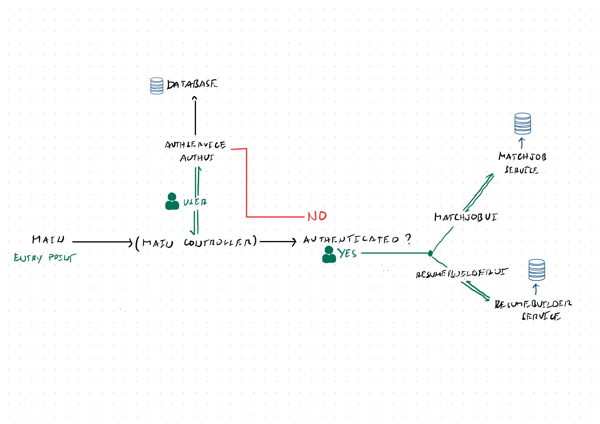

# Resume Analyzer

This is a Java application. You can clone it and run the `Main` class to start.

---

## 🚀 How to Run

### 1. Clone this repository

### 2. Open the project in any Java IDE
- IntelliJ IDEA (recommended)
- Eclipse
- NetBeans
- VS Code (Java extensions required)

### 3. Run the Main class
1. Navigate to: `src/main/java/Main.java`
2. Open the file
3. Run the program (Right-click → **Run 'Main'**)

---

## High-Level Program Flow (Overview)

*Note: This diagram provides a simplified overview and does not reflect exact implementation details.*

---

## How to Improve
- Change the database class implementation to use SQL
- Use encryption for passwords
